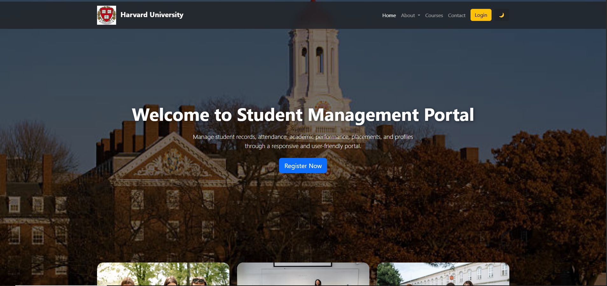
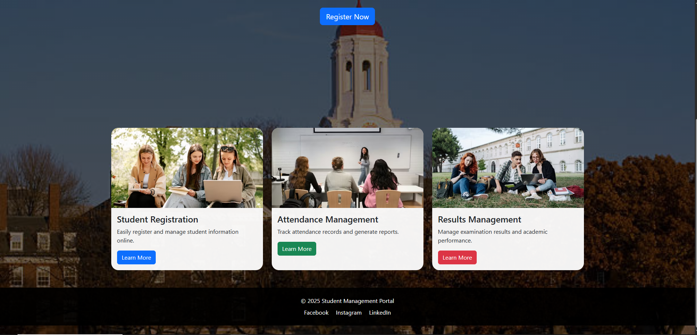
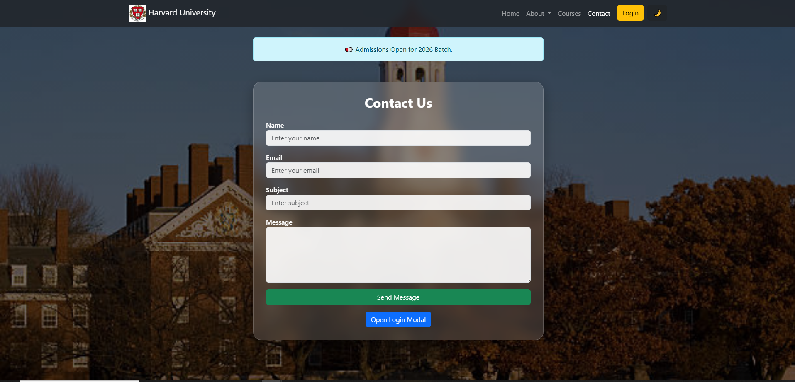
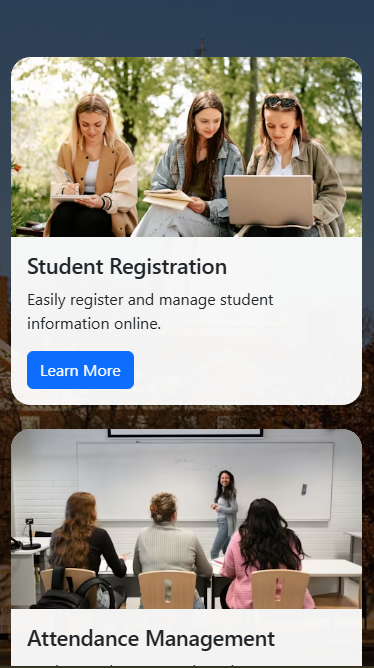

# 🎓 Student Management Portal (Bootstrap 5)

A responsive multi-page Student Management Portal built using **HTML5, CSS3, and Bootstrap 5**.  
This project demonstrates a modern UI for managing student information such as registration, dashboard analytics, profiles, and contact forms.

---

#  Screenshots
##  Home Page

 

 
##  Contact Page

## Mobile View
 
 
 

##  Technologies Used

- HTML5
- CSS3
- Bootstrap 5
- Responsive Web Design

---

##  Responsive Design

The portal is fully responsive and works on:
-  Mobile devices (<576px)
-  Tablets (≥768px)
-  Desktop (≥992px)

---

##  Repository link

https://www.github.com/deekshitha-1701/Student-Management-Portal
